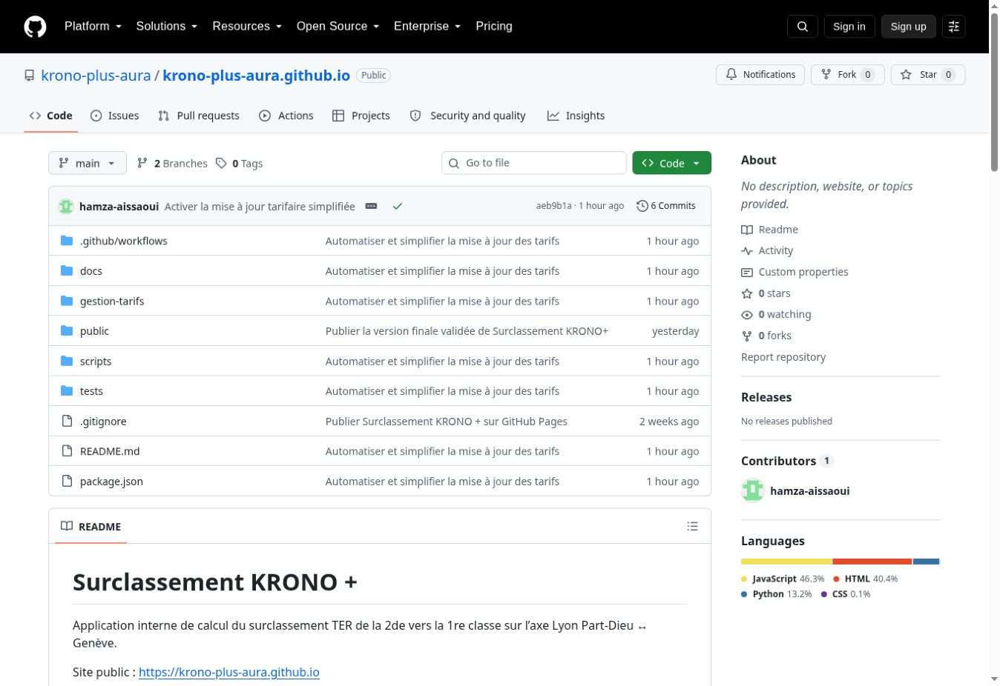
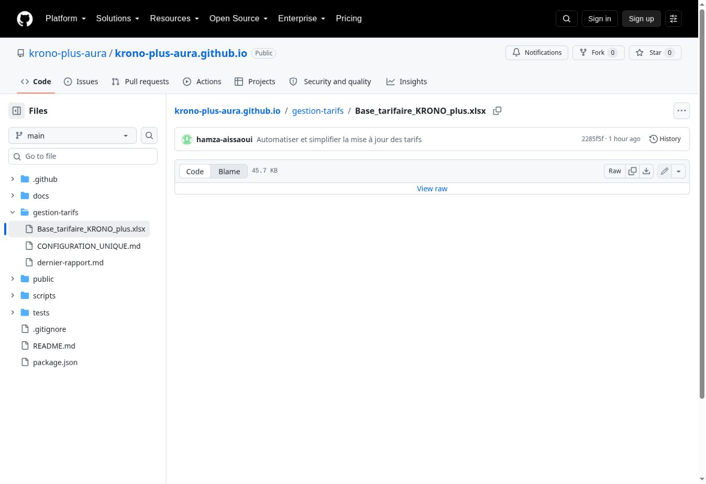
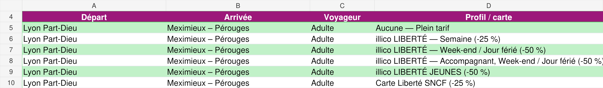
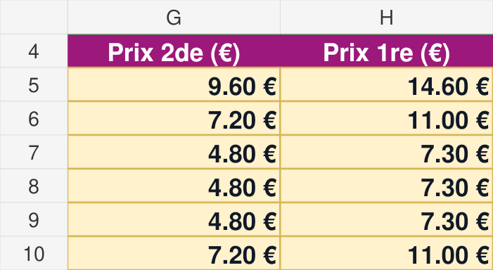
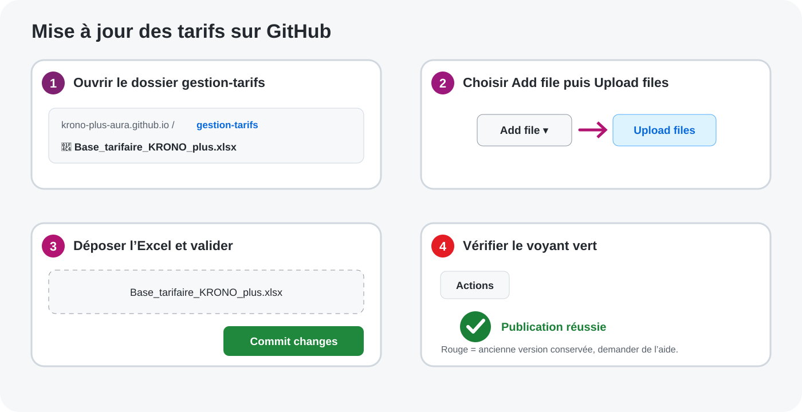
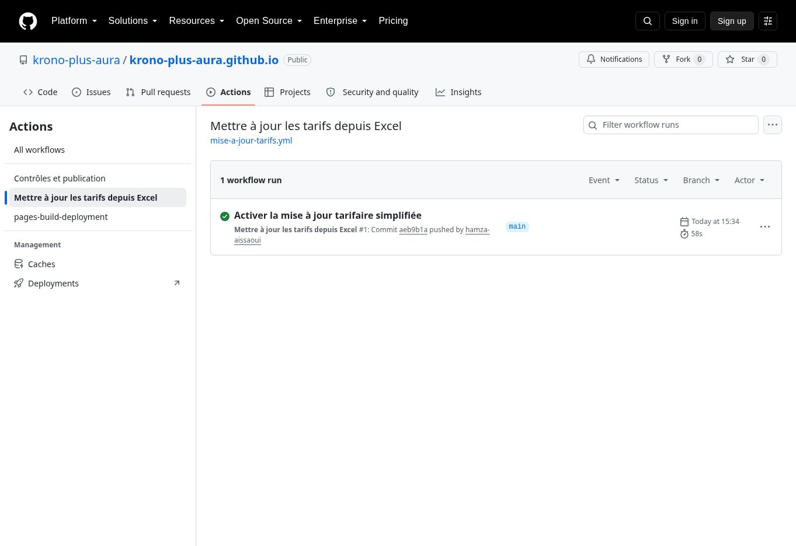

# Mettre à jour les tarifs - guide pas à pas

Cette procédure se fait sur **ordinateur**. Vous modifiez un seul fichier Excel,
puis GitHub contrôle et publie automatiquement.

## Avant de commencer

Préparez :

- la source officielle contenant les nouveaux prix ;
- un ordinateur avec Excel et un navigateur ;
- votre compte GitHub autorisé à modifier le dépôt.

Règle absolue : ne calculez, n'arrondissez, ne déduisez et n'inventez aucun
tarif. Si une information manque ou paraît douteuse, arrêtez la mise à jour.

## Étape 1 - ouvrir le dépôt

1. Ouvrez le dépôt officiel :
   <https://github.com/krono-plus-aura/krono-plus-aura.github.io>.
2. Connectez-vous à GitHub si nécessaire.
3. Vérifiez que la branche affichée en haut à gauche est **main**.
4. Cliquez sur le dossier **gestion-tarifs**.

## Étape 2 - télécharger le bon fichier Excel

1. Dans **gestion-tarifs**, cliquez sur
   **Base_tarifaire_KRONO_plus.xlsx**.
2. Cliquez sur l'icône de téléchargement : flèche vers le bas.
3. Si l'icône n'apparaît pas, cliquez sur **View raw**.
4. Ouvrez le fichier téléchargé dans Excel.

Lien direct :
<https://github.com/krono-plus-aura/krono-plus-aura.github.io/blob/main/gestion-tarifs/Base_tarifaire_KRONO_plus.xlsx>

Ne partez pas d'un ancien fichier reçu par e-mail. Le fichier présent dans
GitHub contient la structure attendue.

## Étape 3 - repérer la bonne ligne dans Excel

1. En bas d'Excel, cliquez sur la feuille **Tarifs**.
2. Repérez la ligne avec les colonnes **Départ**, **Arrivée**, **Voyageur** et
   **Profil / carte**.

## Étape 4 - modifier uniquement les deux prix

Modifiez seulement les cellules jaunes des colonnes :

- **Prix 2de (€)** ;
- **Prix 1re (€)**.

Recopiez exactement les deux montants lus sur la source officielle. Ne touchez
pas aux gares, profils, identifiants, clés, sources ou autres colonnes. N'ajoutez
et ne supprimez aucune ligne.

Enregistrez en conservant exactement ce nom :
`Base_tarifaire_KRONO_plus.xlsx`.

Fermez ensuite Excel.

## Étape 5 - déposer le fichier sur GitHub

1. Revenez dans le dossier **gestion-tarifs** du dépôt.
2. Cliquez sur **Add file**, puis **Upload files**.
3. Sélectionnez l'Excel que vous venez d'enregistrer.
4. Vérifiez que GitHub affiche exactement
   `Base_tarifaire_KRONO_plus.xlsx` comme fichier remplacé.
5. Dans **Commit message**, écrivez :
   `Mettre à jour les tarifs du JJ/MM/AAAA`.
6. Choisissez le commit direct sur **main** si GitHub vous le demande.
7. Cliquez sur le bouton vert **Commit changes**.

Si **Add file** n'apparaît pas, vérifiez que vous êtes connecté avec le compte
invité comme collaborateur. Ne partagez jamais un mot de passe.

## Étape 6 - attendre le voyant vert

1. Cliquez sur l'onglet **Actions** en haut du dépôt.
2. Ouvrez **Mettre à jour les tarifs depuis Excel**.
3. Attendez la fin de l'exécution.

- **Vert** : la publication est terminée.
- **Jaune** : le travail est en cours. Attendez sans redéposer le fichier.
- **Rouge** : rien de nouveau n'est publié et l'ancienne version reste en
  ligne. Ouvrez l'exécution, faites une capture du message d'erreur et
  transmettez-la à Hamza.

GitHub contrôle les 684 lignes, les 1 368 montants, les doublons, les cases
vides, le minimum de 1,20 €, l'ordre 2de/1re et le mode hors connexion. Il ne
crée aucun tarif.

## Après le voyant vert

1. Ouvrez <https://krono-plus-aura.github.io/> avec Internet.
2. Vérifiez au moins le trajet et le profil réellement modifiés.
3. Sur chaque téléphone, attendez quelques secondes, fermez complètement
   l'application puis relancez-la.
4. Coupez le réseau et vérifiez que l'application s'ouvre et calcule toujours.

Le PDF illustré complet est disponible dans ce même dossier :
`Guide_simple_mise_a_jour_tarifs_KRONO_plus.pdf`.
