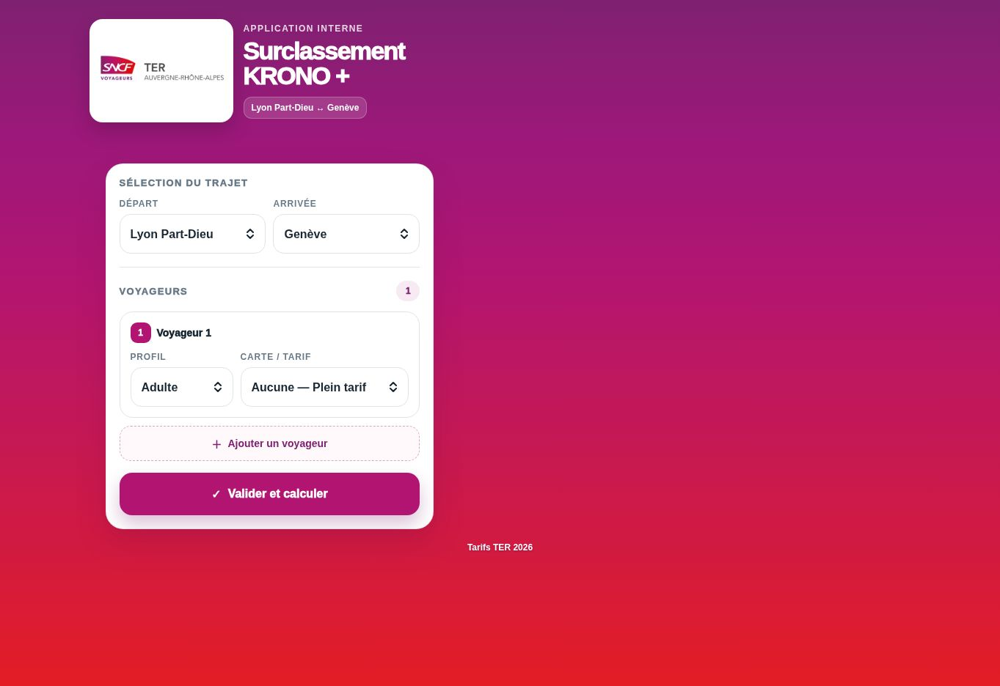
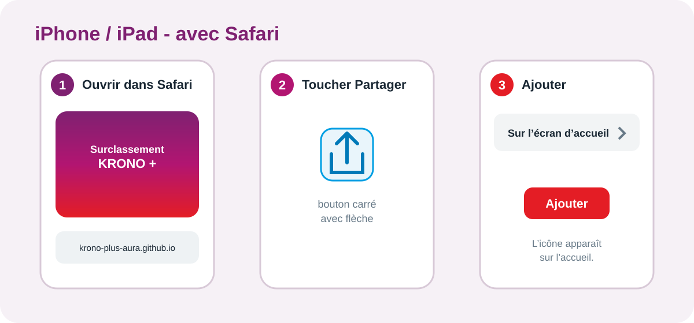
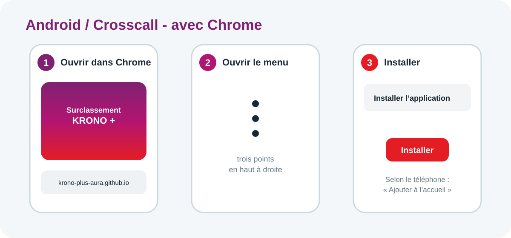

# Surclassement KRONO + - guide utilisateur

## Accès direct

Adresse officielle : <https://krono-plus-aura.github.io/>

L'application fonctionne sur iPhone, iPad, Android, Crosscall et ordinateur.

## Calculer un surclassement

1. Sélectionnez la gare de départ et la gare d'arrivée.
2. Choisissez **Adulte** ou **Enfant**, puis la carte du voyageur.
3. Touchez **Ajouter un voyageur** si vous calculez pour un groupe.
4. Touchez **Valider et calculer**.
5. Lisez le total du groupe et le détail par voyageur.

Sur ordinateur, ouvrez simplement le lien dans votre navigateur. L'installation
n'est pas obligatoire.

## Ajouter sur l'écran d'accueil - iPhone ou iPad

Utilisez **Safari**.

1. Ouvrez l'adresse de l'application dans Safari.
2. Touchez le bouton **Partager** : carré avec une flèche vers le haut.
3. Touchez **Sur l'écran d'accueil**.
4. Activez **Ouvrir comme app web** si l'option apparaît.
5. Touchez **Ajouter**.

## Ajouter sur l'écran d'accueil - Android ou Crosscall

Utilisez **Google Chrome**.

1. Ouvrez l'adresse de l'application dans Chrome.
2. Touchez les **trois points** en haut à droite.
3. Touchez **Installer l'application**. Selon le téléphone, le choix peut
   s'appeler **Installer** ou **Ajouter à l'écran d'accueil**.
4. Confirmez avec **Installer**.

## Préparer le mode hors connexion

Cette préparation se fait une première fois avec Internet :

1. Ouvrez l'application et attendez son affichage complet.
2. Fermez-la complètement.
3. Rouvrez-la.
4. Coupez le Wi-Fi et les données mobiles pour vérifier qu'elle s'ouvre encore.

Avant une prise de service, ouvrez l'application une fois avec Internet afin de
recevoir une éventuelle mise à jour tarifaire.

## Dépannage rapide

- **Ancienne version affichée** : ouvrez l'application avec Internet, attendez
  quelques secondes, fermez-la complètement puis relancez-la.
- **Installation absente sur iPhone** : recommencez avec Safari, sans navigation
  privée.
- **Installation absente sur Android ou Crosscall** : recommencez avec Chrome,
  sans mode Incognito.
- **Plus d'accès hors connexion** : reconnectez le téléphone, ouvrez
  l'application jusqu'à l'affichage complet, fermez-la puis relancez-la.
- **Résultat inhabituel** : notez le trajet, le profil, la carte et les montants,
  puis transmettez ces informations à Hamza.

Le PDF illustré complet est disponible dans ce même dossier :
`Guide_utilisateur_Surclassement_KRONO_plus_GitHub_Pages.pdf`.
